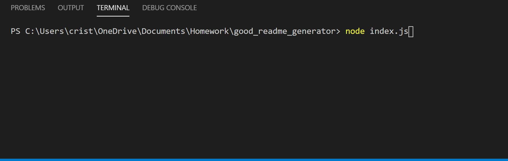
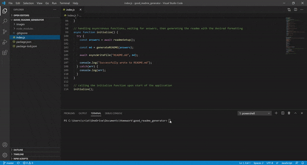
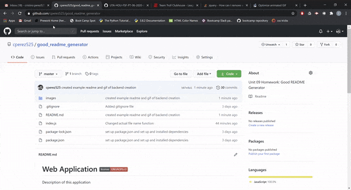

  # README Generator 
  This application was developed to provide an easy and streamlined process for creating descriptive README files for developer projects. It takes in user inputs and one license choice and provides an well-formatted presentation of essential details of the project/application.

  ## Table of Contents
  [Instructions](#instructions)  
  [Usage](#usage)  
  [Contributing](#contributing)  
  [Tests](#tests)  
  [License](#license)  
  [Questions](#questions)

  ## Instructions
  You must have node.js installed to use this application. Upon copying this repository to your local system storage, use the terminal to navigate to the file's location in your system storage, and then run the "npm install" command to install the dependencies necessary to run this application.

  ## Usage
   After navigating to the folder's location in your system storage, enter the "node index.js" command in your terminal to begin running the application. Once you have done this, please respond to the prompts appropriately. After you have answered all prompts, a README file will be created. Please refer to the following gifs as examples of the use of this application:  
    

  ## Contributing
  If you have any recommendations or suggestions for this application, please email me at cristino.perez525@gmail.com

  ## Tests
  To test this application, simply follow the directions provided in the Usage section above, and ensure that all information you provided during the prompts are displayed correctly and in the correct sections.

  ## License
  None

  ## Questions
  You can reach me through one of the following contacts -  
  Github contact: https://github.com/cperez525  
  Email: cristino.perez525@gmail.com
